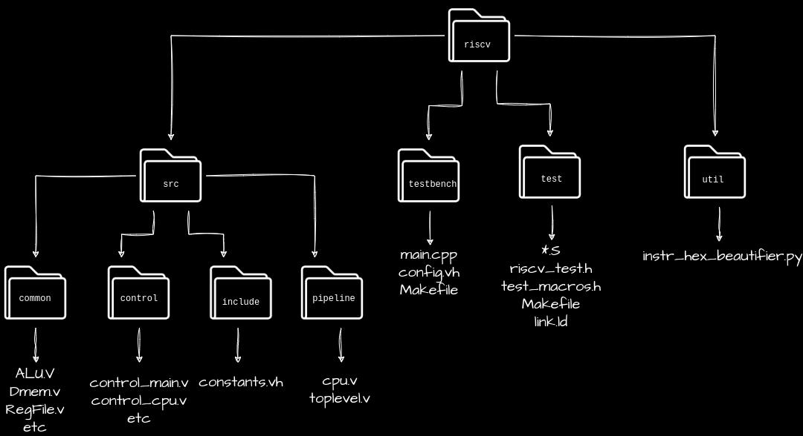

# An RV32I implementation with 5 pipeline stages
A risc-v implementation for our Parallel Computer Architecture Class

## Project Structure
<picture>
  <source media="(prefers-color-scheme: dark)" srcset="docs/file_structure.jpeg">
  
</picture>

## Implemented ISA
The base ISA is RV32I

## Installation
Download the repository
```
$ git clone git@github.com:akastoras/riscv.git
```

## RISC-V ISA Compliance Suite

### Using Docker
To run the device verification tests, build the docker image, or download it from the docker hub.

* To create the image from the Dockerfile run
	```
	$ docker build -t riscv .
	```

* To download the image from docker hub run
	```
	$ docker pull ipanagou/riscv
	```

After acquiring the docker image in either way, create the container with the following instructions
```
$ docker run -it -d --name <container_name> --mount type=bind,source=<absolute-path>/riscv,destination=/home/docker/riscv ipanagou/riscv
$ docker exec -it <container_name> bash
```

### Native installation

* Install RISCV-GNU Toolchain
	```
	$ sudo apt-get install -y autoconf automake autotools-dev curl python3 libmpc-dev \
		libmpfr-dev libgmp-dev gawk build-essential bison flex texinfo gperf libtool \
		patchutils bc zlib1g-dev libexpat-dev

	$ git clone --recursive https://github.com/riscv/riscv-gnu-toolchain
	$ git clone --recursive https://github.com/riscv/riscv-opcodes.git
	$ cd riscv-gnu-toolchain && ./configure --prefix=/opt/riscv --with-arch=rv32gc --with-abi=ilp32d && sudo make

	# Add riscv-gnu-toolchain installation path to path
	$ RISCV=/opt/riscv
	$ PATH="$PATH:$RISCV"
	$ PATH="$PATH:$RISCV/bin"
	$ echo $PATH
	```

* Install verilator and srecord
	```
	sudo apt-get install -y  verilator
	PATH="$PATH:~/.local/bin"
	sudo apt-get install -y srecord
	```

## Building the tests
To build the unit tests, run 
```
$ cd tests
$ make
```

## Compile the model
To compile the **toplevel.v** RISCV model and **main.cpp** testbench into one executable, run

* Vanilla build
	```
	$ cd testbench
	$ make verilate
	$ make build
	```
* To generate .vcd file with waveforms
	```
	$ cd testbench
	$ make verilate VERBOSE=1 TRACE=1
	$ make build
	```

## Run the tests
To run an individual test (for example addi.S), change the variable **TEST** of **testbench/Makefile** file to the test name and run
```
$ cd testbench # if not already in testbech folder
$ make run
```

To run and view the waveforms (provided you compiled with the aforementioned flags)
```
$ cd testbench # if not already in testbench folder
$ make waveforms
```

To run the complete suite of unit tests, run
```
$ make -i check
```

## Makefile notes
For each folder than contains a .v file which in turn defines a module used in a .v in (potentially another folder) add -I\<relative path to the folder from folder testbench\> to the VERILATOR_INCLUDES variable in the **testbench/Makefile**. Basically, include all folders that contain a .v file

You don't need to `include paths, just the name of the file, the -I flag will take care of the rest
